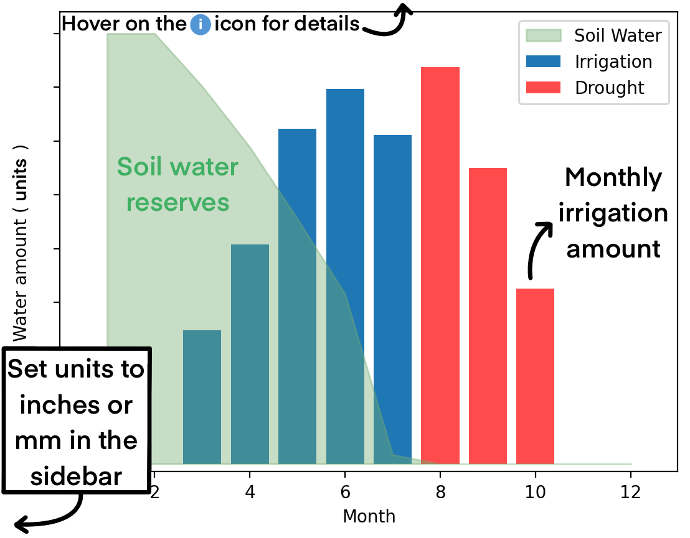

# Almond i-MAP (irrigation **M**onthly **A**nnual **P**lanner) 

Crop soil water accounting - deriving field level transpiration potential and climatic conditions from satellite imagery. 
A novel irrigation approach by Or Sperling, Zac Ellis, Niccolò Tricerri, and Maciej Zwieniecki. 

